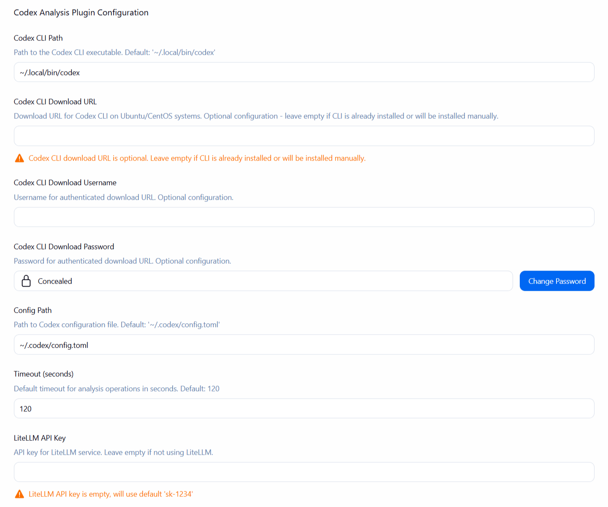
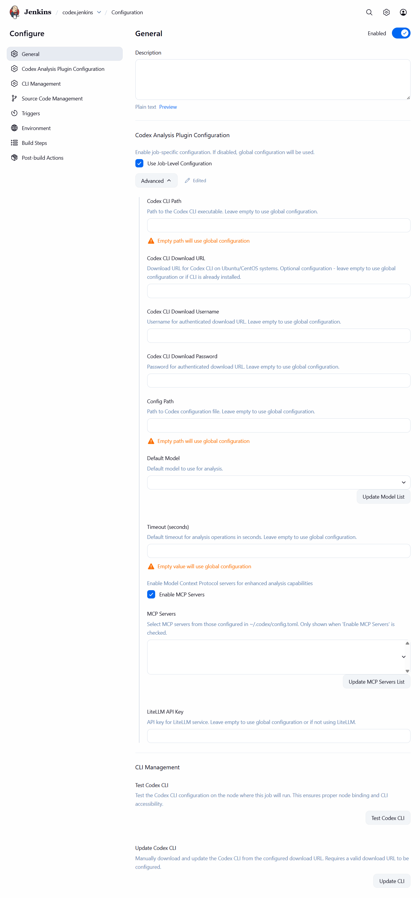

# Codex Plugin for Jenkins

A Jenkins plugin that provides AI-powered analysis capabilities for pipeline stages, steps, and script output using the [Codex CLI](https://github.com/openai/codex).

## Features

- **Pipeline Step Analysis**: Use the `codexAnalysis` step in your Pipeline scripts
- **Stage-level Analysis**: Automatic analysis of pipeline stages with context gathering
- **Freestyle Job Support**: Add Codex analysis as a build step in freestyle jobs
- **Multiple Analysis Types**: Build, test, deployment, security, performance, and quality analysis
- **Configurable Models**: Support for various AI models (GPT-4, Claude, Gemini, etc.)
- **Job-Level Configuration**: Configure Codex settings per job with node-specific testing
- **Rich UI**: Detailed analysis results with issue detection and summaries

## Prerequisites

Before using this plugin, ensure you have:

1. **Codex CLI installed and configured**
   - Follow the installation guide at [codex.sh](https://github.com/codex-router/codex.sh/blob/main/README.md)
   - Ensure the CLI is in your system PATH
   - Configure your API keys and model settings

2. **Network access** to the model provider's API

## Installation

1. Download the plugin HPI file from the releases page
2. Go to **Manage Jenkins** → **Manage Plugins** → **Advanced**
3. Upload the HPI file in the "Upload Plugin" section
4. Restart Jenkins

## Configuration

### Global Configuration

Configure the plugin globally in **Manage Jenkins** → **Configure System** → **Codex Analysis Plugin**:



- **Codex CLI Path**: Path to the Codex CLI executable (default: "~/.local/bin/codex")
- **Codex CLI Download URL**: Download URL for Codex CLI on Ubuntu/CentOS systems (required)
- **Codex CLI Download Username**: Username for authenticated download URL (optional)
- **Codex CLI Download Password**: Password for authenticated download URL (optional)
- **Config Path**: Path to Codex configuration file (default: "~/.codex/config.toml")
- **MCP Servers Path**: Path to MCP servers configuration file (default: "~/.codex/config.toml")
- **Default Model**: Default model to use for analysis (default: "kimi-k2")
- **Timeout**: Default timeout for analysis operations in seconds (default: 120)
- **Enable MCP Servers**: Enable Model Context Protocol servers for enhanced analysis capabilities
- **MCP Servers**: Select MCP servers from those configured in ~/.codex/config.toml (only shown when 'Enable MCP Servers' is checked)
- **LiteLLM API Key**: API key for LiteLLM service (default: "sk-1234")

### Job-Level Configuration

You can also configure Codex settings per job by adding the **Codex Analysis Plugin Configuration** in the job's configuration page:



1. Go to your job's configuration page
2. Scroll down to find **Codex Analysis Plugin Configuration**
3. Enable **Use Job-Level Configuration** to override global settings
4. Configure job-specific settings:
   - **Codex CLI Path**: Override the global CLI path for this job
   - **Codex CLI Download URL**: Override the global CLI download URL for this job
   - **Codex CLI Download Username**: Override the global CLI download username for this job
   - **Codex CLI Download Password**: Override the global CLI download password for this job
   - **Manual CLI Update**: Use the "Update CLI" button to manually download and update Codex CLI from the download URL (job-level only)
   - **Config Path**: Override the global config path for this job
   - **MCP Servers Path**: Override the global MCP servers path for this job
   - **Default Model**: Override the global default model for this job
   - **Timeout**: Override the global timeout for this job
   - **Enable MCP Servers**: Override the global MCP servers setting for this job
   - **MCP Servers**: Override the global MCP servers selection for this job (only shown when 'Enable MCP Servers' is checked)
   - **LiteLLM API Key**: Override the global LiteLLM API key for this job
5. Use the **Test Codex CLI** button to verify the CLI is accessible on the node where this job will run
6. Use the **Update CLI** button to manually download and update the Codex CLI when needed

**Note**: CLI testing and updating are only available at the job level to ensure proper node binding. This allows you to test and update the Codex CLI configuration in the context of the specific node where your job will execute.

### MCP Servers Configuration

The plugin supports Model Context Protocol (MCP) servers for enhanced analysis capabilities. MCP servers provide additional tools and context to the Codex CLI during analysis. The plugin reads MCP server configurations from `~/.codex/config.toml` and allows you to select which servers to enable for analysis.

**Prerequisites:**
- MCP servers must be configured in `~/.codex/config.toml` following the [Codex CLI documentation](https://github.com/openai/codex/blob/main/docs/config.md#mcp-cli-commands)
- The plugin will automatically detect available MCP servers from the configuration file
- All required MCP server executables and dependencies must be installed on the system

**How It Works:**
1. **Configuration Detection**: The plugin reads `~/.codex/config.toml` and extracts MCP server names
2. **Server Selection**: Users can select which servers to enable from a dropdown list
3. **Multi-Selection**: Multiple servers can be selected for combined functionality
4. **Fallback Support**: If no servers are found, common examples are provided

#### MCP Server Types

**1. stdio Servers**
- **Purpose**: Local command-line tools and scripts
- **Configuration**: Command and arguments to execute
- **Use Cases**: File system tools, local utilities, custom scripts

**2. http Servers**
- **Purpose**: Remote HTTP-based services
- **Configuration**: URL endpoint and authentication
- **Use Cases**: Web APIs, remote services, cloud-based tools

#### MCP Server Configuration Fields

Each MCP server can be configured with the following fields:

- **Name**: Unique identifier for the server
- **Type**: Server type (stdio or http)
- **Enabled**: Whether this server is active
- **Command**: Command to execute (stdio servers only)
- **Arguments**: Command line arguments (stdio servers only)
- **URL**: HTTP endpoint URL (http servers only)
- **Bearer Token Environment Variable**: Environment variable containing authentication token (http servers only)
- **Startup Timeout**: Timeout for server startup (default: 10 seconds)
- **Tool Timeout**: Timeout for individual tool calls (default: 60 seconds)

#### Configuration Examples

**Example ~/.codex/config.toml with MCP Servers:**
```toml
[mcp.servers."filesystem"]
type = "stdio"
command = "/usr/local/bin/mcp-filesystem"
args = ["--root", "/workspace"]
startup_timeout_sec = 10
tool_timeout_sec = 60

[mcp.servers."github-api"]
type = "http"
url = "https://api.github.com/mcp"
bearer_token_env_var = "GITHUB_TOKEN"
startup_timeout_sec = 15
tool_timeout_sec = 120

[mcp.servers."database"]
type = "stdio"
command = "/opt/mcp-tools/db-connector"
args = ["--host", "localhost", "--port", "5432", "--database", "myapp"]
startup_timeout_sec = 20
tool_timeout_sec = 90
```

**Jenkins Plugin Selection:**
- In the Jenkins configuration, you would see a dropdown with options: "filesystem", "github-api", "database"
- You can select multiple servers (e.g., "filesystem" and "github-api") for multi-selection

#### MCP Server Configuration Workflow

**Step 1: Configure MCP Servers in ~/.codex/config.toml**
1. Edit the `~/.codex/config.toml` file to define your MCP servers
2. Follow the [Codex CLI documentation](https://github.com/openai/codex/blob/main/docs/config.md#mcp-cli-commands) for proper configuration format
3. Ensure all required commands and dependencies are installed

**Step 2: Enable MCP Servers in Jenkins**
1. Check the "Enable MCP Servers" checkbox in global or job configuration
2. The "MCP Servers" selection list will become visible

**Step 3: Select MCP Servers**
1. Choose which MCP servers to enable from the dropdown list
2. The list shows all servers configured in `~/.codex/config.toml`
3. You can select multiple servers for multi-selection

**Step 4: Test and Validate**
1. Use the "Test Codex CLI" button to verify configuration
2. Check Jenkins logs for any MCP server startup issues
3. Monitor analysis performance with MCP servers enabled

### Configuration Hierarchy

The plugin uses a three-tier configuration hierarchy:

1. **Step/Builder Level** (Highest Priority)
   - Parameters specified directly in the `codexAnalysis` step or build step
   - Overrides both job-level and global settings

2. **Job Level** (Medium Priority)
   - Settings configured in the job's "Codex Analysis Plugin Configuration"
   - Only applies when "Use Job-Level Configuration" is enabled
   - Overrides global settings

3. **Global Level** (Lowest Priority)
   - System-wide settings in "Manage Jenkins" → "Configure System"
   - Used as fallback when job-level settings are empty or disabled

### Best Practices

- **Global Configuration**: Set sensible defaults for your organization
- **Job-Level Configuration**: Use for jobs that need specific CLI paths or models
- **Node Testing**: Always test CLI accessibility at the job level to ensure proper node binding
- **Fallback Strategy**: Leave job-level settings empty to inherit global defaults

## Usage

### Pipeline Step Usage

Use the `codexAnalysis` step in your Pipeline scripts:

```groovy
pipeline {
    agent any

    stages {
        stage('Build') {
            steps {
                sh 'mvn clean compile'
                codexAnalysis(
                    content: 'Build completed successfully',
                    analysisType: 'build_analysis',
                    prompt: 'Analyze this build output and suggest improvements'
                )
            }
        }

        stage('Test') {
            steps {
                sh 'mvn test'
                codexAnalysis(
                    content: 'Test execution completed',
                    analysisType: 'test_analysis',
                    includeContext: true
                )
            }
        }
    }
}
```

### Freestyle Job Usage

1. Go to your job configuration
2. Add "Codex Analysis" build step
3. Configure the analysis parameters:
   - **Content to Analyze**: Text content to analyze
   - **Analysis Type**: Type of analysis to perform
   - **Custom Prompt**: Optional custom prompt
   - **Model**: Model to use (optional, uses default if empty)
   - **Timeout**: Analysis timeout in seconds
   - **Include Build Context**: Include build environment in analysis
   - **Fail on Error**: Fail build if analysis encounters errors
   - **Additional Parameters**: Custom parameters in key=value format

### Analysis Types

- **general**: General analysis and insights
- **build_analysis**: Build process and output analysis
- **test_analysis**: Test results and coverage analysis
- **deployment_analysis**: Deployment process analysis
- **security_analysis**: Security vulnerability analysis
- **performance_analysis**: Performance metrics analysis
- **quality_analysis**: Code quality and best practices analysis

## Examples

### Comprehensive CI/CD Pipeline

```groovy
pipeline {
    agent any

    stages {
        stage('Build') {
            steps {
                sh 'mvn clean compile'
                codexAnalysis(
                    content: 'Maven compilation completed',
                    analysisType: 'build_analysis',
                    includeContext: true
                )
            }
        }

        stage('Test') {
            steps {
                sh 'mvn test'
                codexAnalysis(
                    content: 'Unit tests executed',
                    analysisType: 'test_analysis',
                    prompt: 'Review test execution and suggest improvements'
                )
            }
        }

        stage('Security Scan') {
            steps {
                sh 'mvn dependency:check'
                codexAnalysis(
                    content: 'Security dependency check completed',
                    analysisType: 'security_analysis',
                    includeContext: true
                )
            }
        }

        stage('Deploy') {
            when {
                branch 'main'
            }
            steps {
                sh 'mvn deploy'
                codexAnalysis(
                    content: 'Application deployed successfully',
                    analysisType: 'deployment_analysis',
                    includeContext: true
                )
            }
        }
    }

    post {
        always {
            codexAnalysis(
                content: 'Pipeline execution completed',
                analysisType: 'general',
                prompt: 'Provide a comprehensive analysis of this CI/CD pipeline execution'
            )
        }
    }
}
```

### Advanced Analysis with Custom Parameters

```groovy
pipeline {
    agent any

    stages {
        stage('Advanced Analysis') {
            steps {
                script {
                    def buildOutput = sh(
                        script: 'mvn clean compile 2>&1',
                        returnStdout: true
                    ).trim()

                    def analysisResult = codexAnalysis(
                        content: buildOutput,
                        analysisType: 'build_analysis',
                        model: 'gpt-4',
                        timeoutSeconds: 180,
                        additionalParams: [
                            'temperature': '0.7',
                            'max_tokens': '2000',
                            'include_code': 'true'
                        ]
                    )

                    echo "Analysis result: ${analysisResult}"
                }
            }
        }
    }
}
```

### Job-Level Configuration Example

For jobs that need specific Codex CLI configurations:

1. **Configure Job-Level Settings**:
   - Go to your job's configuration page
   - Find "Codex Analysis Plugin Configuration"
   - Enable "Use Job-Level Configuration"
   - Set job-specific values:
     - **Codex CLI Path**: `/usr/local/bin/codex` (if different from global)
     - **Default Model**: `claude-3-opus` (for this specific job)
     - **Timeout**: `300` (longer timeout for complex analysis)

2. **Test Configuration**:
   - Click "Test Codex CLI" to verify the CLI is accessible on the node
   - Ensure the test passes before running the job

3. **Use in Pipeline**:
   ```groovy
   pipeline {
       agent any

       stages {
           stage('Analysis') {
               steps {
                   // This will use job-level configuration
                   codexAnalysis(
                       content: 'Build output here',
                       analysisType: 'build_analysis'
                       // model and timeout will be inherited from job config
                   )
               }
           }
       }
   }
   ```

## Troubleshooting

### Common Issues

1. **Codex CLI not found**
   - Ensure the CLI is installed and in PATH
   - Check the "Codex CLI Path" configuration (global or job-level)
   - Use the job-level "Test Codex CLI" button to verify node accessibility

2. **Timeout errors**
   - Increase the timeout value for complex analyses
   - Check network connectivity to API endpoints
   - Verify timeout settings in job-level configuration

3. **Job-level configuration not working**
   - Ensure "Use Job-Level Configuration" is enabled in job settings
   - Check that job-level values are not empty (empty values fall back to global)
   - Verify the job-level test passes before running the job

4. **Node-specific issues**
   - Test CLI accessibility on the specific node where the job runs
   - Ensure Codex CLI is installed on all nodes, not just the master
   - Check node-specific PATH and environment variables

### Debug Information

- Check build logs for detailed error messages
- Use the "Test Codex CLI" button in job-level configuration to test node-specific CLI accessibility
- Review analysis content and prompts for quality
- Verify that the Codex CLI is accessible on the specific node where your job runs

## Development

### Building the Plugin

```bash
# Clean and build the HPI package
mvn clean package

# (Optional) compile only
mvn compile

# HPI output: target/codex-analysis.hpi
```

### Running Tests

```bash
mvn test

# Quiet unit tests (skip integration tests)
mvn -q -DskipITs=true test
```

### Install the Plugin

Choose one:

- UI: Manage Jenkins → Manage Plugins → Advanced → Upload Plugin → select `target/codex-analysis.hpi` → Upload → Restart Jenkins
- Filesystem: copy `target/codex-analysis.hpi` to `$JENKINS_HOME/plugins/codex-analysis.hpi` and restart Jenkins

### Upgrade the Plugin

Use the Maven Versions Plugin to update `pom.xml`:

```bash
# Set a specific release version
mvn versions:set -DnewVersion=1.0.0

# Or bump snapshot
mvn versions:set -DnewVersion=1.0.1-SNAPSHOT

# Write changes
mvn versions:commit
```

Optional helpers:

```bash
# Show available dependency updates
mvn versions:display-dependency-updates

# Try latest compatible releases (review carefully)
mvn versions:use-latest-releases
```

## Contributing

1. Fork the repository
2. Create a feature branch
3. Make your changes
4. Add tests for new functionality
5. Submit a pull request

## Support

- **Documentation**: [Plugin Help](src/main/resources/help.html)
- **Issues**: Create an issue in the repository
- **Codex CLI**: [https://github.com/openai/codex](https://github.com/openai/codex)
- **Configuration Guide**: [https://github.com/openai/codex/blob/main/docs/config.md](https://github.com/openai/codex/blob/main/docs/config.md)

### Getting Help

1. **Configuration Issues**: Use the job-level "Test Codex CLI" button to diagnose node-specific problems
2. **Global vs Job-Level**: Remember that job-level settings override global settings when enabled
3. **Node Binding**: Always test CLI accessibility at the job level to ensure proper node binding
4. **Fallback Behavior**: Empty job-level settings will use global defaults

## License

This project is licensed under the Apache License 2.0 - see the [LICENSE](LICENSE) file for details.

## Reference

[Codex Config](https://github.com/openai/codex/blob/main/docs/config.md)
