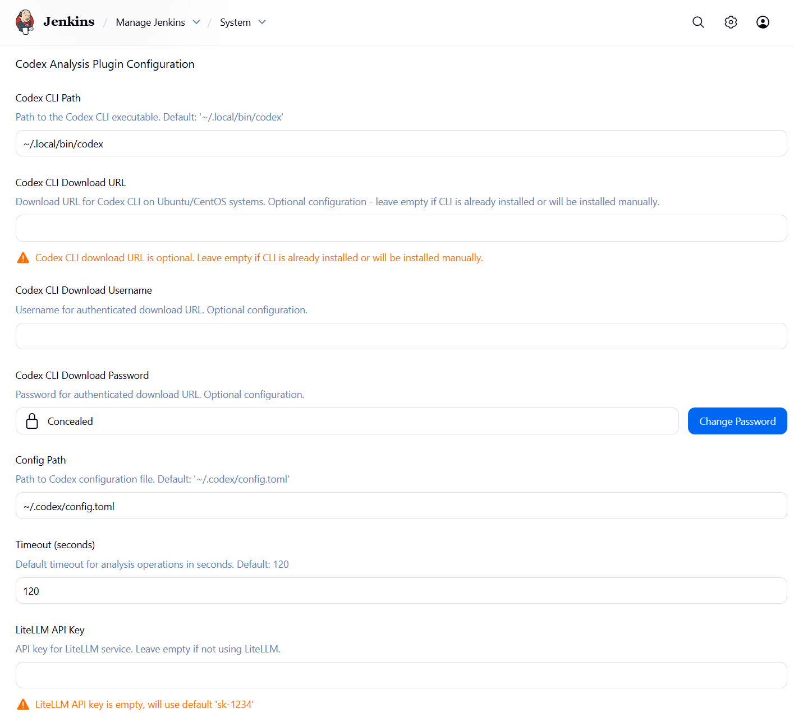

**语言**: [English](README.md) | [中文](README_cn.md)

# Codex Jenkins 插件

一个 Jenkins 插件，使用 [Codex CLI](https://github.com/openai/codex) 为流水线阶段、步骤和脚本输出提供 AI 驱动的分析功能。

## 功能特性

- **流水线步骤分析**：在 Pipeline 脚本中使用 `codexAnalysis` 步骤
- **交互式聊天**：使用 `codexChat` 步骤与 Codex CLI 进行实时交互式聊天会话
- **阶段级分析**：自动分析流水线阶段并收集上下文
- **自由风格任务支持**：在自由风格任务中添加 Codex 分析或交互式聊天作为构建步骤
- **多种分析类型**：构建、测试、部署、安全、性能和质量分析
- **实时控制台日志**：所有聊天对话都会实时流式传输到 Jenkins 控制台输出
- **仅 CLI 模型管理**：直接从 Codex CLI 获取动态模型列表（无硬编码模型）
- **实时模型更新**：模型列表始终反映当前 CLI 功能
- **MCP 服务器支持**：模型上下文协议服务器，增强分析功能
- **动态 MCP 管理**：直接从 Codex CLI 更新 MCP 服务器列表（带缓存）
- **任务级配置**：为每个任务配置 Codex 设置，支持节点特定测试
- **丰富的 UI**：详细的分析结果，包含问题检测和摘要
- **CLI 管理**：直接从 Jenkins 下载和更新 Codex CLI（任务级）

## 前置要求

在使用此插件之前，请确保：

1. **已安装并配置 Codex CLI**
   - 按照 [codex.sh](https://github.com/codex-router/codex.sh/blob/main/README.md) 的安装指南操作
   - 确保 CLI 在系统 PATH 中
   - 配置您的 API 密钥和模型设置
   - **重要**：模型列表从 Codex CLI 动态获取 - 不提供硬编码模型
   - **注意**：Codex CLI 下载 URL 配置是可选的 - 您可以手动安装 CLI 或使用插件的下载功能

2. **网络访问**模型提供商的 API

## 安装

1. 从发布页面下载插件 HPI 文件
2. 转到 **管理 Jenkins** → **管理插件** → **高级**
3. 在"上传插件"部分上传 HPI 文件
4. 重启 Jenkins

## 配置

### 全局配置

在 **管理 Jenkins** → **系统配置** → **Codex Analysis Plugin** 中全局配置插件：



- **Codex CLI 路径**：Codex CLI 可执行文件的路径（默认："~/.local/bin/codex"）
- **Codex CLI 下载 URL**：Ubuntu/CentOS 系统上 Codex CLI 的下载 URL（可选）
- **Codex CLI 下载用户名**：用于身份验证下载 URL 的用户名（可选）
- **Codex CLI 下载密码**：用于身份验证下载 URL 的密码（可选）
- **配置路径**：Codex 配置文件路径（默认："~/.codex/config.toml"）
- **超时**：分析操作的默认超时时间（秒）（默认：120）
- **LiteLLM API 密钥**：LiteLLM 服务的 API 密钥（默认：空）

**注意**：默认模型和 MCP 服务器配置仅在任务级别可用，以便更精细的控制。

### 任务级配置

您还可以在任务的配置页面中添加 **Codex Analysis Plugin Configuration** 来为每个任务配置 Codex 设置：


1. 转到任务的配置页面
2. 向下滚动找到 **Codex Analysis Plugin Configuration**
3. 启用 **使用任务级配置** 以覆盖全局设置
4. 配置任务特定设置：
   - **Codex CLI 路径**：为此任务覆盖全局 CLI 路径
   - **Codex CLI 下载 URL**：为此任务覆盖全局 CLI 下载 URL（可选）
   - **Codex CLI 下载用户名**：为此任务覆盖全局 CLI 下载用户名
   - **Codex CLI 下载密码**：为此任务覆盖全局 CLI 下载密码
   - **手动 CLI 更新**：使用"更新 CLI"按钮从下载 URL 手动下载和更新 Codex CLI（仅任务级）
   - **配置路径**：为此任务覆盖全局配置路径
   - **默认模型**：为此任务配置默认模型（无默认值 - 必须从可用模型中选择）
     - 使用"更新模型列表"按钮从 Codex CLI 获取可用模型
     - 模型列表从 Codex CLI 动态填充 - 无硬编码模型
   - **超时**：为此任务覆盖全局超时
   - **启用 MCP 服务器**：为此任务启用模型上下文协议服务器（默认：禁用）
   - **MCP 服务器**：为此任务选择 MCP 服务器（仅在选中"启用 MCP 服务器"时显示）
     - 使用"更新 MCP 服务器列表"按钮从 Codex CLI 获取可用服务器
     - MCP 服务器配置是任务特定的
   - **LiteLLM API 密钥**：为此任务覆盖全局 LiteLLM API 密钥（默认：空）
5. 使用 **测试 Codex CLI** 按钮验证 CLI 在此任务将运行的节点上是否可访问
6. 使用 **更新 CLI** 按钮在需要时手动下载和更新 Codex CLI

**注意**：CLI 测试和更新仅在任务级别可用，以确保正确的节点绑定。这允许您在任务将执行的特定节点的上下文中测试和更新 Codex CLI 配置。

### MCP 服务器配置

插件支持模型上下文协议（MCP）服务器以增强分析功能。MCP 服务器在分析期间为 Codex CLI 提供额外的工具和上下文。插件从 `~/.codex/config.toml` 读取 MCP 服务器配置，并允许您选择要为分析启用的服务器。

**前置要求：**
- MCP 服务器必须在 `~/.codex/config.toml` 中配置，遵循 [Codex CLI 文档](https://github.com/openai/codex/blob/main/docs/config.md#mcp-cli-commands)
- 插件将自动从配置文件检测可用的 MCP 服务器
- 所有必需的 MCP 服务器可执行文件和依赖项必须安装在系统上

**工作原理：**
1. **配置检测**：插件读取 `~/.codex/config.toml` 并提取 MCP 服务器名称
2. **服务器选择**：用户可以从下拉列表中选择要启用的服务器
3. **多选**：可以选择多个服务器以组合功能
4. **回退支持**：如果未找到服务器，将提供常见示例
5. **动态更新**：使用"更新 MCP 服务器列表"按钮从 Codex CLI 刷新服务器列表

#### MCP 服务器类型

**1. stdio 服务器**
- **用途**：本地命令行工具和脚本
- **配置**：要执行的命令和参数
- **用例**：文件系统工具、本地实用程序、自定义脚本

**2. http 服务器**
- **用途**：基于 HTTP 的远程服务
- **配置**：URL 端点和身份验证
- **用例**：Web API、远程服务、基于云的工具

#### MCP 服务器配置字段

每个 MCP 服务器可以使用以下字段进行配置：

- **名称**：服务器的唯一标识符
- **类型**：服务器类型（stdio 或 http）
- **已启用**：此服务器是否处于活动状态
- **命令**：要执行的命令（仅 stdio 服务器）
- **参数**：命令行参数（仅 stdio 服务器）
- **URL**：HTTP 端点 URL（仅 http 服务器）
- **Bearer Token 环境变量**：包含身份验证令牌的环境变量（仅 http 服务器）
- **启动超时**：服务器启动的超时时间（默认：10 秒）
- **工具超时**：单个工具调用的超时时间（默认：60 秒）

#### 配置示例

**带有 MCP 服务器的 ~/.codex/config.toml 示例：**
```toml
[mcp.servers."filesystem"]
type = "stdio"
command = "/usr/local/bin/mcp-filesystem"
args = ["--root", "/workspace"]
startup_timeout_sec = 10
tool_timeout_sec = 60

[mcp.servers."github-api"]
type = "http"
url = "https://api.github.com/mcp"
bearer_token_env_var = "GITHUB_TOKEN"
startup_timeout_sec = 15
tool_timeout_sec = 120

[mcp.servers."database"]
type = "stdio"
command = "/opt/mcp-tools/db-connector"
args = ["--host", "localhost", "--port", "5432", "--database", "myapp"]
startup_timeout_sec = 20
tool_timeout_sec = 90
```

**Jenkins 插件选择：**
- 在 Jenkins 配置中，您会看到一个下拉列表，选项包括："filesystem"、"github-api"、"database"
- 您可以选择多个服务器（例如，"filesystem" 和 "github-api"）进行多选

#### MCP 服务器配置工作流

**步骤 1：在 ~/.codex/config.toml 中配置 MCP 服务器**
1. 编辑 `~/.codex/config.toml` 文件以定义您的 MCP 服务器
2. 遵循 [Codex CLI 文档](https://github.com/openai/codex/blob/main/docs/config.md#mcp-cli-commands) 了解正确的配置格式
3. 确保所有必需的命令和依赖项都已安装

**步骤 2：在 Jenkins 中启用 MCP 服务器**
1. 在全局或任务配置中选中"启用 MCP 服务器"复选框
2. "MCP 服务器"选择列表将变为可见

**步骤 3：选择 MCP 服务器**
1. 从下拉列表中选择要启用的 MCP 服务器
2. 列表显示在 `~/.codex/config.toml` 中配置的所有服务器
3. 您可以选择多个服务器进行多选

**步骤 4：测试和验证**
1. 使用"测试 Codex CLI"按钮验证配置
2. 检查 Jenkins 日志以查找任何 MCP 服务器启动问题
3. 在启用 MCP 服务器的情况下监控分析性能

### 配置层次结构

插件使用三层配置层次结构：

1. **步骤/构建器级别**（最高优先级）
   - 直接在 `codexAnalysis` 或 `codexChat` 步骤或构建步骤中指定的参数
   - 覆盖任务级和全局设置

2. **任务级别**（中等优先级）
   - 在任务的"Codex Analysis Plugin Configuration"中配置的设置
   - 仅在启用"使用任务级配置"时应用
   - 覆盖全局设置

3. **全局级别**（最低优先级）
   - 在"管理 Jenkins" → "系统配置"中的系统范围设置
   - 当任务级设置为空或禁用时用作回退

**注意**：`codexAnalysis` 和 `codexChat` 步骤都遵循此配置层次结构，用于模型选择、超时和其他设置。

### 最佳实践

- **全局配置**：为您的组织设置合理的默认值
- **任务级配置**：用于需要特定 CLI 路径或模型的任务
- **节点测试**：始终在任务级别测试 CLI 可访问性，以确保正确的节点绑定
- **回退策略**：将任务级设置留空以继承全局默认值

## 使用方法

### 流水线步骤用法

在 Pipeline 脚本中使用 `codexAnalysis` 步骤：

```groovy
pipeline {
    agent any

    stages {
        stage('Build') {
            steps {
                sh 'mvn clean compile'
                codexAnalysis(
                    content: 'Build completed successfully',
                    analysisType: 'build_analysis',
                    prompt: 'Analyze this build output and suggest improvements'
                )
            }
        }

        stage('Test') {
            steps {
                sh 'mvn test'
                codexAnalysis(
                    content: 'Test execution completed',
                    analysisType: 'test_analysis',
                    includeContext: true
                )
            }
        }
    }
}
```

### 交互式聊天用法

使用 `codexChat` 步骤与 Codex CLI 进行交互式聊天会话。所有对话都会实时记录到控制台：

```groovy
pipeline {
    agent any

    stages {
        stage('Interactive Chat') {
            steps {
                codexChat(
                    initialMessage: 'Hello, can you help me analyze my build?',
                    model: 'gpt-4',
                    timeoutSeconds: 300
                )
            }
        }
    }
}
```

**聊天步骤参数：**
- **initialMessage**：启动聊天会话的可选初始消息
- **context**：可选的上下文信息（如果未提供，将自动包含构建上下文）
- **model**：用于聊天的模型（可选，使用任务或全局配置中的默认值）
- **timeoutSeconds**：聊天会话的超时时间（秒）（默认：120）
- **additionalParams**：key=value 格式的附加参数

### 自由风格任务用法

#### Codex 分析构建步骤

1. 转到任务配置
2. 添加"Codex Analysis"构建步骤
3. 配置分析参数：
   - **要分析的内容**：要分析的文本内容
   - **分析类型**：要执行的分析类型
   - **自定义提示**：可选的自定义提示
   - **模型**：要使用的模型（可选，如果为空则使用默认值）
   - **超时**：分析超时时间（秒）
   - **包含构建上下文**：在分析中包含构建环境
   - **出错时失败**：如果分析遇到错误则使构建失败
   - **附加参数**：key=value 格式的自定义参数

#### Codex 交互式聊天构建步骤

1. 转到任务配置
2. 添加"Codex Interactive Chat"构建步骤
3. 配置聊天参数：
   - **初始消息**：启动聊天会话的可选初始消息
   - **上下文**：可选的上下文信息（如果未提供，将自动包含构建上下文）
   - **模型**：用于聊天的模型（可选，使用任务或全局配置中的默认值）
   - **超时**：聊天会话超时时间（秒）（默认：120）
   - **附加参数**：key=value 格式的自定义参数

**注意**：所有聊天对话都会实时流式传输到 Jenkins 控制台输出，使所有 Jenkins 任务都可以看到它们。

### 构建下拉菜单聊天

插件会自动为每个任务的构建下拉菜单（"Timings"旁边）添加 **"Codex Chat"** 选项。这允许您直接从任何构建与 Codex CLI 交互，而无需修改流水线或任务配置。


**使用方法：**

1. 导航到 Jenkins 中的任何构建
2. 单击构建下拉菜单（构建编号旁边的小箭头）
3. 从菜单中选择 **"Codex Chat"**
4. 您将看到一个聊天界面，可以：


   - 输入初始消息以开始对话
   - 提供关于构建的可选上下文（日志、环境等）
   - 发送消息并从 Codex CLI 接收响应
   - 查看对话历史记录

**功能：**
- **自动可用**：自动为每个构建提供 - 无需配置
- **使用配置的 CLI 路径**：自动使用全局或任务配置中的 Codex CLI 路径
- **构建上下文**：聊天在构建的工作区上下文中执行，可访问构建环境
- **交互式界面**：基于 Web 的聊天界面，带消息历史记录
- **实时响应**：从 Codex CLI 获得即时响应

**配置：**
- 聊天功能使用在以下位置配置的 Codex CLI 路径：
  - 任务级配置（如果启用了"使用任务级配置"）
  - 全局配置（作为回退）
- 所有聊天交互都遵循配置的模型、超时和 MCP 服务器设置

**使用示例：**
- 询问构建失败的问题
- 获取构建日志的解释
- 请求改进构建性能的建议
- 分析构建工件或测试结果
- 获取部署问题的帮助

### 分析类型

- **general**：一般分析和见解
- **build_analysis**：构建过程和输出分析
- **test_analysis**：测试结果和覆盖率分析
- **deployment_analysis**：部署过程分析
- **security_analysis**：安全漏洞分析
- **performance_analysis**：性能指标分析
- **quality_analysis**：代码质量和最佳实践分析

## 示例

### 综合 CI/CD 流水线

```groovy
pipeline {
    agent any

    stages {
        stage('Build') {
            steps {
                sh 'mvn clean compile'
                codexAnalysis(
                    content: 'Maven compilation completed',
                    analysisType: 'build_analysis',
                    includeContext: true
                )
            }
        }

        stage('Test') {
            steps {
                sh 'mvn test'
                codexAnalysis(
                    content: 'Unit tests executed',
                    analysisType: 'test_analysis',
                    prompt: 'Review test execution and suggest improvements'
                )
            }
        }

        stage('Security Scan') {
            steps {
                sh 'mvn dependency:check'
                codexAnalysis(
                    content: 'Security dependency check completed',
                    analysisType: 'security_analysis',
                    includeContext: true
                )
            }
        }

        stage('Deploy') {
            when {
                branch 'main'
            }
            steps {
                sh 'mvn deploy'
                codexAnalysis(
                    content: 'Application deployed successfully',
                    analysisType: 'deployment_analysis',
                    includeContext: true
                )
            }
        }
    }

    post {
        always {
            codexAnalysis(
                content: 'Pipeline execution completed',
                analysisType: 'general',
                prompt: 'Provide a comprehensive analysis of this CI/CD pipeline execution'
            )
        }
    }
}
```

### 使用自定义参数的高级分析

```groovy
pipeline {
    agent any

    stages {
        stage('Advanced Analysis') {
            steps {
                script {
                    def buildOutput = sh(
                        script: 'mvn clean compile 2>&1',
                        returnStdout: true
                    ).trim()

                    def analysisResult = codexAnalysis(
                        content: buildOutput,
                        analysisType: 'build_analysis',
                        model: 'gpt-4',
                        timeoutSeconds: 180,
                        additionalParams: [
                            'temperature': '0.7',
                            'max_tokens': '2000',
                            'include_code': 'true'
                        ]
                    )

                    echo "Analysis result: ${analysisResult}"
                }
            }
        }
    }
}
```

### 带构建上下文的交互式聊天

```groovy
pipeline {
    agent any

    stages {
        stage('Build') {
            steps {
                sh 'mvn clean compile'
            }
        }

        stage('Chat Session') {
            steps {
                // 启动交互式聊天，自动包含构建上下文
                codexChat(
                    initialMessage: 'Can you help me understand any issues in my build?',
                    model: 'gpt-4',
                    timeoutSeconds: 300
                )
            }
        }
    }
}
```

### 带自定义上下文的聊天

```groovy
pipeline {
    agent any

    stages {
        stage('Chat with Custom Context') {
            steps {
                script {
                    def customContext = """
                        Project: My Application
                        Build Number: ${env.BUILD_NUMBER}
                        Branch: ${env.BRANCH_NAME}
                        Recent Changes: ${sh(script: 'git log -5 --oneline', returnStdout: true)}
                    """.trim()

                    codexChat(
                        initialMessage: 'Review my recent changes and suggest improvements',
                        context: customContext,
                        model: 'claude-3-opus',
                        timeoutSeconds: 600
                    )
                }
            }
        }
    }
}
```

### 任务级配置示例

对于需要特定 Codex CLI 配置的任务：

1. **配置任务级设置**：
   - 转到任务的配置页面
   - 找到"Codex Analysis Plugin Configuration"
   - 启用"使用任务级配置"
   - 设置任务特定值：
     - **Codex CLI 路径**：`/usr/local/bin/codex`（如果与全局不同）
     - **默认模型**：`claude-3-opus`（用于此特定任务）
     - **超时**：`300`（复杂分析的更长超时）

2. **测试配置**：
   - 单击"测试 Codex CLI"以验证 CLI 在节点上是否可访问
   - 在运行任务之前确保测试通过

3. **在流水线中使用**：
   ```groovy
   pipeline {
       agent any

       stages {
           stage('Analysis') {
               steps {
                   // 这将使用任务级配置
                   codexAnalysis(
                       content: 'Build output here',
                       analysisType: 'build_analysis'
                       // model 和 timeout 将从任务配置继承
                   )
               }
           }
       }
   }
   ```

## 故障排除

### 常见问题

1. **找不到 Codex CLI**
   - 确保 CLI 已安装并在 PATH 中
   - 检查"Codex CLI 路径"配置（全局或任务级）
   - 使用任务级"测试 Codex CLI"按钮验证节点可访问性
   - **注意**：如果您需要自动下载 CLI，请配置"Codex CLI 下载 URL"（可选）

2. **超时错误**
   - 为复杂分析增加超时值
   - 检查到 API 端点的网络连接
   - 验证任务级配置中的超时设置

3. **任务级配置不工作**
   - 确保在任务设置中启用了"使用任务级配置"
   - 检查任务级值不为空（空值会回退到全局）
   - 在运行任务之前验证任务级测试通过

4. **节点特定问题**
   - 在任务运行的特定节点上测试 CLI 可访问性
   - 确保 Codex CLI 安装在所有节点上，而不仅仅是主节点
   - 检查节点特定的 PATH 和环境变量

5. **MCP 服务器不可用**
   - 确保 MCP 服务器在 `~/.codex/config.toml` 中正确配置
   - 使用"更新 MCP 服务器列表"按钮从 Codex CLI 刷新服务器列表
   - 检查配置文件路径是否正确且可访问
   - 验证 MCP 服务器可执行文件已安装并在 PATH 中
   - 如果 CLI 失败，插件将回退到直接解析配置文件

6. **模型列表未更新**
   - 使用"更新模型列表"按钮从 Codex CLI 刷新可用模型
   - 检查 Codex CLI 是否使用 API 密钥正确配置
   - 验证到模型提供商 API 的网络连接
   - 模型列表缓存 5 分钟 - 等待缓存过期或重启 Jenkins

7. **下拉列表中无可用模型**
   - **仅 CLI 方法**：插件仅从 Codex CLI 获取模型 - 不提供硬编码模型
   - 确保 Codex CLI 已正确安装且可访问
   - 使用"更新模型列表"按钮从 CLI 获取模型
   - 检查 `codex models list` 命令在您的终端中是否工作
   - 验证 API 密钥已在 Codex CLI 中配置
   - 如果没有模型出现，CLI 可能未正确配置或不可访问

8. **模型验证警告**
   - 当 CLI 没有可用模型时，模型验证会显示警告
   - 当 CLI 不可访问或未配置时，这是预期行为
   - 使用"更新模型列表"按钮获取可用模型
   - 确保 Codex CLI 已正确安装并使用 API 密钥配置

### 调试信息

- 检查构建日志以获取详细的错误消息
- 使用任务级配置中的"测试 Codex CLI"按钮测试节点特定的 CLI 可访问性
- 查看分析内容和提示的质量
- 验证 Codex CLI 在任务运行的特定节点上是否可访问

## 开发

### 构建插件

```bash
# 清理并构建 HPI 包
mvn clean package

# （可选）仅编译
mvn compile

# HPI 输出：target/codex-analysis.hpi
```

### 运行测试

```bash
mvn test

# 静默单元测试（跳过集成测试）
mvn -q -DskipITs=true test
```

### 安装插件

选择以下方式之一：

- UI：管理 Jenkins → 管理插件 → 高级 → 上传插件 → 选择 `target/codex-analysis.hpi` → 上传 → 重启 Jenkins
- 文件系统：将 `target/codex-analysis.hpi` 复制到 `$JENKINS_HOME/plugins/codex-analysis.hpi` 并重启 Jenkins

### 升级插件

使用 Maven Versions 插件更新 `pom.xml`：

```bash
# 设置特定的发布版本
mvn versions:set -DnewVersion=1.0.0

# 或增加快照版本
mvn versions:set -DnewVersion=1.0.1-SNAPSHOT

# 提交更改
mvn versions:commit
```

可选辅助工具：

```bash
# 显示可用的依赖更新
mvn versions:display-dependency-updates

# 尝试最新的兼容版本（仔细审查）
mvn versions:use-latest-releases
```

## 贡献

1. Fork 仓库
2. 创建功能分支
3. 进行更改
4. 为新功能添加测试
5. 提交拉取请求

## 支持

- **文档**：[插件帮助](src/main/resources/help.html)
- **问题**：在仓库中创建问题
- **Codex CLI**：[https://github.com/openai/codex](https://github.com/openai/codex)
- **配置指南**：[https://github.com/openai/codex/blob/main/docs/config.md](https://github.com/openai/codex/blob/main/docs/config.md)

### 获取帮助

1. **配置问题**：使用任务级"测试 Codex CLI"按钮诊断节点特定问题
2. **全局与任务级**：记住启用时任务级设置会覆盖全局设置
3. **节点绑定**：始终在任务级别测试 CLI 可访问性，以确保正确的节点绑定
4. **回退行为**：空的任务级设置将使用全局默认值

## 许可证

本项目根据 Apache License 2.0 许可 - 有关详细信息，请参阅 [LICENSE](LICENSE) 文件。

## 参考

[codex-config](https://github.com/openai/codex/blob/main/docs/config.md)

